      
    

    <h2 align="center">📧 Email 📧</h2>

  <Strong> <a href="mailto:hyeonseokim.e@gmail.com">hyeonseokim.e@gmail.com</a> </Strong>

 

    <h2 style="border-bottom: 1px solid #d8dee4; color: #282d33;"> ✨ Tech Stack ✨ </h2>
    
 
      
      
      
      
      
    
 

    <h2 style="border-bottom: 1px solid #d8dee4; color: #282d33;"> 📋 Stats 📋 </h2>
    

 
